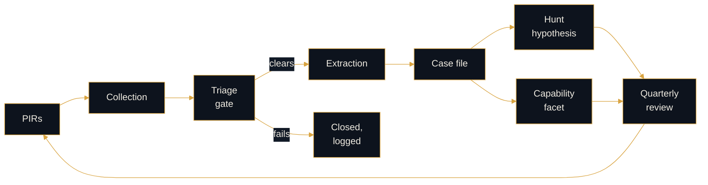

# Method

```console
rogue-prompt:~$ cd 01-method
```

**The intelligence cycle, pointed at adversary use of AI.**

Provider misuse reporting is finished intelligence about adversary AI tradecraft, published by the parties with direct visibility into it. Most enterprises read it as industry news. This section treats it as a collection source and runs the cycle against it.

Method is published on purpose. In intelligence, published method is how standing is conferred, and the judgment calls it does not make are the part that matters. Two people can run the same gates and produce different verdicts. The verdicts are in `02`.

---

## What is here

| File | What it is | Status |
|---|---|---|
| [`actor-profiling.md`](actor-profiling.md) | Reading provider misuse reporting as CTI, with the full extract set | **live** |
| [`collection-plan.md`](collection-plan.md) | Standing PIRs, source tiers, triage gate, cadence | **live** |
| [`extraction-method.md`](extraction-method.md) | Report to finished intelligence, with gates | **live** |
| [`guardrail-interaction.md`](guardrail-interaction.md) | Goal-directedness under obstruction as an attribution surface | drafting |

---

## The cycle



The feedback edge is the part that makes this a program. Case files accumulate into nothing unless something periodically asks what the body of work now says that it did not say last quarter.

---

## The two questions everything turns on

**Force multiplier or new capability.** Did the model make an existing capability cheaper, or create one the actor did not previously have? Full treatment in `extraction-method.md`. The bar for claiming new capability is high and the failure mode is inflation.

**What could this actor not afford?** Attribution reads constraint. Every choice an adversary makes is made under conditions, and the conditions are the fingerprint. AI tooling choices are a new surface for that same read.

---

## Discipline

Labels as defined in the root README: `[ANALYSIS]`, `[DESIGN]`, `[OPEN]`.

Public reporting only. Never upgrade a provider's confidence language. Never assert an actor link the provider did not assert. Nothing drawn from any employer environment, and nothing derived from non-public collection.

> _All opinions are my own and do not reflect my employer._
