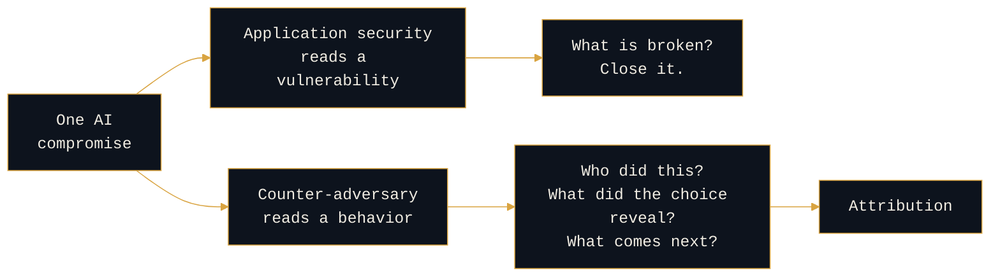

# Reading the AI Adversary

```console
rogue-prompt:~$ cd 01-reading-the-ai-adversary
```

**The lead section.** Who attacks AI, how they persist, and what the way they do it reveals about *who they are.*

The root README states the thesis: attribution comes from context, not indicators, and how an adversary abused the AI is new context. This section is where that thesis gets worked against specific adversary behavior. The defense section (`02`) exists to show what this implies, not the other way around.

---

## What is here

```console
rogue-prompt:~$ ls
```

| Path | What it is | Status |
|---|---|---|
| [`persistence-typology/`](persistence-typology) | Persistence mechanism read as an actor-intent signal (a series) | anchor and memory poisoning **live** |
| [`kill-chains/`](kill-chains) | One chain per OWASP LLM ID, two lenses each | method and LLM01 **live** |
| [`actor-profiling.md`](actor-profiling.md) | Threat-actor-to-AI-tooling profiling, public actors | drafting |

---

## The move all three share

Each of these takes something the industry reads as a vulnerability and reads it instead as adversary behavior.



Same artifact. Two readings. Only one of them produces an actor.

- **The persistence typology** reads the mechanism an actor chose as a tell about their sophistication, patience, and reach. Four mechanisms, four different adversaries.
- **The kill chains** read the chain past the model's edge and into the campaign, because the AI compromise is a pivot, and what the actor did after it is the profile.
- **Actor profiling** reads provider attribution reporting as finished intelligence about AI tradecraft, rather than as news.

Both questions are legitimate and they are complementary. Only the second one produces attribution, and it is largely missing from the agentic AI security literature.

---

## Discipline

```console
rogue-prompt:~$ cat conventions
```

Labels are used as defined in the root README: `[ANALYSIS]`, `[DESIGN]`, `[OPEN]`.

The typology and its series are labeled `[OPEN]` on purpose. The mechanism-to-sophistication mapping is reasoned from traditional tradecraft and has not yet been validated against a body of attributed agentic intrusions.

**Public cases and general method only.** Nothing here is drawn from any employer environment.

> _All opinions are my own and do not reflect my employer._
