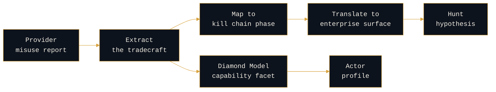

# Threat-Actor-to-AI-Tooling Profiling

```console
rogue-prompt:~$ cat actor-profiling
```

**`[ANALYSIS]`** with staked `[OPEN]` claims, marked inline.

Provider attribution reporting is one of the most underused CTI sources in the field today. When Google's Threat Intelligence Group, Microsoft, OpenAI, and Anthropic publish attributed misuse of frontier models, those disclosures are finished intelligence about adversary AI tradecraft. Most enterprises read them as news. The defender's job is to read them as CTI: extract the tradecraft, translate it into what an enterprise should expect, and turn it into hunt hypotheses.

This section is the synthesizer between provider-side attribution and enterprise-side defense. It feeds the attribution-as-convergence frame directly: an actor's AI tooling choices become one more facet of capability on the Diamond Model.

---

## The pipeline



Two outputs from one input. The hunt hypothesis is what a SOC actions this quarter. The actor profile is what makes the next report readable faster.

---

## The extraction method

```console
rogue-prompt:~$ cat method
```

For each attributed case in a provider report, pull the following. This is deliberately mechanical, because the value is in doing it consistently across many reports rather than deeply on one.

| Extract | Why it matters |
|---|---|
| **Actor and confidence** | Determines whether this joins an existing profile or opens a new one |
| **Capability used** | Reconnaissance, lure generation, code assistance, translation, tooling, operational support |
| **Kill chain phase** | Places the AI use in the campaign rather than treating it as a standalone event |
| **Force multiplier or new capability** | The central analytic question |
| **Sophistication of the ask** | Whether the actor pushed the model hard or used it as a search engine |
| **Guardrail interaction** | Whether they attempted evasion, and how patiently |
| **Enterprise-facing implication** | What the defender should now expect to see, and where |

The guardrail interaction line is the one most often skipped and the one that carries the most about the actor. An actor who abandons a refused request behaves differently from one who spends weeks reformulating it, and that difference is a sophistication and patience signal, which is the same read the persistence typology makes on a different surface.

---

## The argument, in detail

<details>
<summary><b>Why this source is underused</b></summary>

<br>

```console
rogue-prompt:~$ cat problem
```

Provider misuse reports occupy an awkward position. They are too technical for the press to cover past the headline, and too far from the enterprise perimeter for most security teams to action. So they get read as industry news, filed, and forgotten.

That is a mistake, for three reasons.

**They are attributed.** Most open-source AI security research describes techniques without an actor. Provider reports name the actor, or at minimum the cluster, which is exactly the thing that makes intelligence actionable rather than interesting.

**They are behavioral, not atomic.** A provider report rarely gives you a hash or a domain. It gives you what an actor tried to do and how they went about it, which sits at the top of the Pyramid of Pain, where the durable signal lives.

**They cover the pre-intrusion phases.** Much of what providers observe is reconnaissance, target research, lure development, and tooling work, which happens before anything touches the enterprise. That is the earliest possible warning, and almost nobody is consuming it as such.

</details>

<details>
<summary><b>The central analytic question: force multiplier or new capability</b></summary>

<br>

```console
rogue-prompt:~$ cat force-multiplier-or-new-capability
```

For every observed use, ask one question: **did the model make an existing capability cheaper, or did it create a capability the actor did not previously have?**

The distinction drives everything downstream. A force multiplier changes volume, speed, and cost, which changes your detection thresholds and your triage load, but not your threat model. A genuinely new capability changes the threat model itself.

**`[OPEN]`** My reading of the public record so far is that the overwhelming majority of attributed misuse falls on the force-multiplier side: faster reconnaissance, more fluent lures, quicker code scaffolding, better translation. Useful to adversaries, and not a discontinuity. The defensive implication is unglamorous but important: most of what provider reporting describes should raise your expected volume rather than send you rebuilding your controls.

This is a staked claim ahead of a full corpus review, and it is the kind of claim that should age. If a provider report lands that clearly demonstrates a capability an actor could not otherwise field, that is a finding worth its own writeup, and it would move this claim.

</details>

<details>
<summary><b>Feeding the Diamond Model</b></summary>

<br>

```console
rogue-prompt:~$ cat diamond
```

The Diamond Model puts adversary, capability, infrastructure, and victim at four vertices. AI tooling is not a fifth vertex. It is a facet of **capability**, and treating it as a separate thing is the error that keeps AI security siloed from CTI.

Read that way, model choice, prompting style, guardrail-evasion patience, and which tasks an actor delegates all become capability characteristics that can be tracked across reports and correlated with an actor's known tradecraft elsewhere. Same analytic machinery, new axis.

**`[OPEN]`** The claim worth testing over time is whether AI tooling choices are durable enough to be attributive. Infrastructure is cheap to rotate and hashes are cheaper. Habits of use may prove stickier, because they reflect how a team actually works. That is a hypothesis, not a finding, and it needs a corpus of attributed cases across multiple reporting cycles before it can be argued properly.

</details>

<details>
<summary><b>From tradecraft to hunt hypothesis</b></summary>

<br>

```console
rogue-prompt:~$ cat translation
```

The translation step is where most teams stall, because provider-side observations do not map cleanly onto enterprise telemetry. The bridge is to ask what the observed activity produces downstream, and hunt for that.

Worked at the level of method rather than specific detections:

**Reconnaissance and target research** produces better-targeted first contact. The hunt is not for the research itself, which happened on a platform you do not own, but for the quality shift in what arrives: lures that reference real internal structure, correct names, plausible context.

**Lure and content generation** removes the language and formatting tells that many awareness programs were built around. The hunt hypothesis is that your existing phishing detections degrade in effectiveness over time, which is a measurable thing to test rather than assume.

**Code and tooling assistance** shortens the gap between a published technique and a working implementation. The hunt is for compressed timelines between public disclosure and observed use, which is a metric worth tracking directly.

</details>

<details>
<summary><b>What provider reporting cannot tell you</b></summary>

<br>

```console
rogue-prompt:~$ cat limitations
```

This source has real and structural blind spots, and using it well means holding them in view.

**It only sees one platform.** Each provider observes activity on its own models. An actor operating on open-weight models locally is entirely invisible to this reporting, and the actors most worth worrying about have the resources to do exactly that. The corpus is therefore biased toward actors who chose convenience over operational security.

**It is biased toward the attributable.** Providers report what they could attribute, which skews the record toward actors already well characterized elsewhere. Novel or careful actors are underrepresented by construction.

**Disclosure is discretionary.** What gets published is shaped by legal, commercial, and policy considerations, not by defender need. Absence of reporting is not evidence of absence of use.

**`[OPEN]`** Taken together, these mean the public record is a floor, not a picture. The honest way to state any finding drawn from this corpus is as a lower bound on adversary AI adoption.

</details>

<details>
<summary><b>Sourcing discipline</b></summary>

<br>

```console
rogue-prompt:~$ cat sourcing
```

Public reporting only: provider threat reports, GTIG, Mandiant, CISA advisories, and equivalent published work. Public actors and public cases. Nothing here is drawn from any employer environment, and nothing here is a detection, a rule, or an operational artifact.

Specific report titles, dates, and actor designations are verified against the primary source before publication. Where this page argues from the shape of the public record rather than a single citation, it says so.

</details>

---

> _All opinions are my own and do not reflect my employer._
