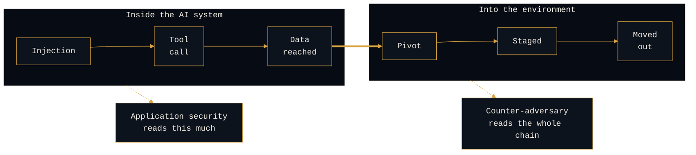

# Kill Chains for AI Attacks

```console
rogue-prompt:~$ cd kill-chains
```

**`[ANALYSIS]`, theory-craft.** Part of Reading the AI Adversary. These are hypotheses about how attacks against AI systems actually run, and where they break, staked in the open and mapped to public frameworks. Not a deployed defense. A way of reasoning about one, tested against the incidents as they arrive.

---

## The claim

Every attack against an AI system is a kill chain. It has stages, and the adversary has to clear all of them to win.

Most AI security writing stops at "here is the vulnerability." A kill chain asks the more useful questions: what are the stages in order, where can a defender interdict each one, and which single interdiction collapses the whole chain.

This section reads one chain per OWASP LLM Top 10 entry, and it puts two lenses on every chain, because one lens without the other is either a catalog or a single point of failure.

---

## The chain does not stop at the model's edge

Most AI kill-chain writing ends inside the AI system: injection, tool call, exfil, done. But an adversary rarely wants the model. They want what the model can reach. The AI compromise is usually a pivot, and the stages that follow are part of the same chain.



Reading only the in-model stages is the application-security view. Reading the full chain, across the boundary and into the campaign, is the counter-adversary view, and it is where the context that attributes an actor lives.

**Which door they came in is a vulnerability. What they did once inside is a profile.** Every writeup notes where the chain leaves the AI system, because that hand-off is often the most revealing stage of all.

---

## Two lenses on every chain

| | Lens 1: courses of action | Lens 2: structural chokepoint |
|---|---|---|
| **Question** | Where *can* I interdict? | Which interdiction *matters most*? |
| **Model** | Lockheed Martin courses of action | The structural-versus-statistical partition |
| **Output** | One interdiction per stage | One precondition that collapses the chain |
| **Alone, it becomes** | A catalog | A single point of failure |

Coverage without priority is a catalog. Priority without coverage is a single point of failure. You publish both.

<details>
<summary><b>Lens 1: the courses-of-action matrix (coverage)</b></summary>

<br>

```console
rogue-prompt:~$ cat lens-1
```

For each stage of the chain, name an interdiction. This is the Lockheed Martin Cyber Kill Chain courses-of-action model (Detect, Deny, Disrupt, Degrade, Deceive, Destroy) applied to the AI surface.

The value is coverage: if one control fails, a later stage still offers a chance to catch the adversary. This is the defense-in-depth view, and it is the table in every writeup.

</details>

<details>
<summary><b>Lens 2: the structural chokepoint (priority)</b></summary>

<br>

```console
rogue-prompt:~$ cat lens-2
```

The matrix tells you where you *can* interdict. It does not tell you which interdiction matters most, and on the AI surface most of the per-stage controls are statistical (a classifier reading language), which means they can be evaded, usually silently.

So on top of the matrix, every writeup names one structural precondition that collapses the entire chain regardless of the other stages. Structural, per the partition in the defense-in-depth work: a control that decides from a fact the adversary cannot rewrite (a signed token, an egress allowlist, a bind manifest), not a classifier that can be talked around.

The chokepoint is the "if you fix one thing, fix this" answer, and it almost always sits at the stage where the adversary's chain depends on something they do not control.

</details>

---

## The method

```console
rogue-prompt:~$ cat method
```

How each writeup is built.

1. Anchor to an OWASP LLM Top 10 ID (`LLM01` through `LLM10`).
2. Lay out the chain, stage by stage, as the adversary runs it.
3. Map each stage to its MITRE ATLAS technique by name, and pin the exact technique ID to the current ATLAS version before publishing. The matrix moves, and a stale ID is the kind of thing a reviewer catches.
4. Build the courses-of-action matrix: one interdiction per stage.
5. Flag the one structural chokepoint and say why it beats the per-stage controls around it.
6. State where it breaks. Some chains have no structural chokepoint, and the honest writeup says so rather than pretending a classifier closes it.

---

## Series index

| Chain | OWASP ID | Status |
|---|---|---|
| [`llm01-direct-injection.md`](llm01-direct-injection.md) | `LLM01` | **live** |
| llm02 through llm10 | `LLM02` to `LLM10` | to come, same structure |

---

<details>
<summary><b>A framework-precision note (this matters)</b></summary>

<br>

```console
rogue-prompt:~$ cat framework-precision
```

Two taxonomies get blurred constantly, and blurring them costs credibility.

| Framework | Tactics | What it is |
|---|---|---|
| **Lockheed Martin courses of action** | Detect, Deny, Disrupt, Degrade, Deceive, Destroy | A per-stage interdiction model |
| **MITRE D3FEND tactics** | Model, Harden, Detect, Isolate, Deceive, Evict | A defensive-technique knowledge graph, not a per-stage matrix |

They share two words (Detect, Deceive) and are otherwise different tools.

This section uses the Lockheed Martin courses of action for the per-stage matrix, and references D3FEND only when naming a specific defensive technique. It does not present one as the other.

</details>

<details>
<summary><b>Attribution</b></summary>

<br>

```console
rogue-prompt:~$ cat prior-art
```

| Concept | Source |
|---|---|
| Cyber Kill Chain, courses-of-action matrix | Lockheed Martin |
| Adversary technique vocabulary | MITRE ATLAS, mapped by technique, IDs verified against the current release before publishing |
| Risk taxonomy anchor | OWASP Top 10 for LLM Applications 2025 |
| The lethal trifecta | Simon Willison, 2025 |

The structural-chokepoint idea builds on the structural-versus-statistical partition in the defense-in-depth section of this repository.

</details>

---

> _All opinions are my own and do not reflect my employer._
