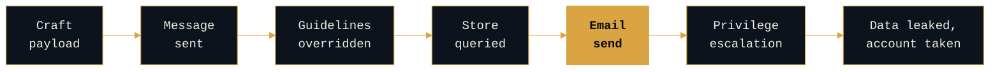

# LLM01 Direct Injection: The Chain Breaks at the Send, Not the Prompt

```console
rogue-prompt:~$ cat llm01-direct-injection
```

**`[ANALYSIS]`, theory-craft.** One kill chain for OWASP `LLM01` (Prompt Injection), read with both lenses. A hypothesis about how the chain runs and where it collapses, staked in public and open to being wrong.

---

## The scenario

An attacker sends a crafted message to a customer-support chatbot that can read a private data store and send email. The message tells the model to ignore its guidelines, query the private store, and email the results out. If it lands, the outcome is data disclosure, and from there, privilege escalation and account takeover.

This is the textbook `LLM01` case, and it is worth doing precisely because it is textbook. If the method does not clarify the obvious chain, it will not survive the hard ones.

---

## The chain



Seven stages. The adversary has to clear all of them. The gold stage is the one that does not depend on a classifier, and cutting it collapses everything downstream of it.

---

## Lens 1: courses of action (coverage)

```console
rogue-prompt:~$ cat lens-1
```

One interdiction per stage, using the Lockheed Martin courses-of-action verbs. ATLAS techniques are named; exact IDs are pinned to the current release before publishing.

| Stage | Adversary action | ATLAS technique | Course of action | Control |
|---|---|---|---|---|
| Craft payload | Injection designed | LLM Prompt Injection | **Deny** | Authentication and rate limiting; block unauthenticated access |
| Malicious message | "Ignore previous instructions" | LLM Prompt Injection: Direct | **Disrupt** | Input filtering (semantic and pattern) |
| Guidelines overridden | System prompt bypassed | Jailbreak / prompt injection | **Disrupt** | Prompt hardening; constrain role; lock instructions |
| Unauthorized data query | Private store read | Discovery / data access | **Degrade, Deceive** | Least privilege on data scope; canary records seeded in the store |
| Email send | Exfiltration | Exfiltration via AI Agent Tool Invocation (`AML.T0086`) | **Deny** | Structural egress allowlist; human approval gate as the statistical fallback |
| Privilege escalation | Acts as admin | Impact | **Detect** | Output and action monitoring; alert on anomalous action |

That table is the coverage story: there is something to do at every stage, and defense in depth means an attacker has to beat all of them.

The Deceive cell is real deception in the courses-of-action sense. Canary records seeded in the private store turn a successful unauthorized read into a detection event. That is the counter-adversary use of the store itself, and it fires precisely when every control upstream of it has already failed.

---

## Lens 2: the structural chokepoint (priority)

```console
rogue-prompt:~$ cat lens-2
```

The matrix shows where you *can* interdict. It does not show which interdiction you would never trade away, and on this chain most of the per-stage controls are statistical.

| Control | Why it is not the chokepoint |
|---|---|
| Input filtering | A classifier, so it can be evaded |
| Prompt hardening | A classifier, so it can be evaded |
| Least privilege | Helps, but does not stop a query the model is authorized to make |
| Human approval gate | Better, but approval fatigue makes it unreliable at volume, and a persuasive message is exactly what an injected model produces |

The one stage where the chain depends on something the adversary does not control is **the send**. The whole attack is an exfiltration, and exfiltration needs an outbound channel.

So the chokepoint is a structural egress allowlist: the chatbot may send only to destinations approved out of band, destinations the injected content cannot set. Cut that channel and the injection can still fire, the model can still be steered, the private store can still be queried, and none of it reaches the attacker.

This is the external-communication leg of the lethal trifecta (private data, untrusted content, external communication), and it is the one leg you can cut without breaking the chatbot's real job. It beats the human-approval gate at the same stage because it decides from a fixed list, a fact the adversary cannot rewrite, instead of from a tired human reading a convincing request.

**One precondition, chain collapsed.** That is the difference between a matrix that says "you have options" and an argument that says "protect this first."

---

<details>
<summary><b>Where it breaks</b></summary>

<br>

```console
rogue-prompt:~$ cat limitations
```

**The allowlist is not always viable.** If the chatbot legitimately needs to email arbitrary external addresses, the chokepoint does not exist, and you fall back to the weaker approval gate plus detection. The honest version says so rather than pretending the chokepoint is always available.

**It closes one exfiltration path, not all harm.** The allowlist stops exfiltration by email. It does not stop the model being steered into a harmful answer shown directly to the user, which is a different chain with no exfil leg and no clean structural chokepoint.

**The upstream controls still earn their place.** They buy cost and they buy detection signal. The chokepoint is not a reason to drop the other controls. It is a reason to know which one you would defend last.

</details>

<details>
<summary><b>Attribution</b></summary>

<br>

```console
rogue-prompt:~$ cat prior-art
```

| Concept | Source |
|---|---|
| Courses-of-action model and kill chain | Lockheed Martin |
| Exfiltration via AI Agent Tool Invocation | MITRE ATLAS `AML.T0086` |
| Other techniques | Named by function; IDs verified against the current ATLAS release |
| Risk anchor | OWASP Top 10 for LLM Applications 2025, `LLM01` Prompt Injection |
| The lethal trifecta | Simon Willison, 2025 |

The structural-versus-statistical framing comes from the defense-in-depth section of this repository.

</details>

---

> _All opinions are my own and do not reflect my employer._
