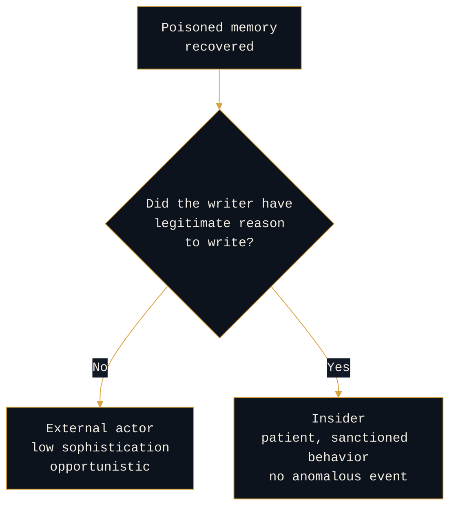

# Reading Memory Poisoning: The Opportunist's Foothold, and the Insider's Cover

```console
rogue-prompt:~$ cat 01-memory-poisoning
```

**`[OPEN]` hypothesis.** Part 1 of the Persistence Typology series. The anchor piece ([`00-persistence-typology.md`](00-persistence-typology.md)) lays out the lens: the persistence mechanism an actor chooses is a signal of intent and sophistication, the same way it is in traditional intrusion analysis. This piece reads the first of the four mechanisms. It is a hypothesis from tradecraft analogy, not a validated finding, and it says so throughout.

---

## The move nobody logs as a choice

When an AI agent is compromised and the attacker leaves something behind in its memory, most teams record one fact: the agent was compromised. That is the equivalent of writing "host was persistent" in an intrusion report and closing the ticket. It throws away the most useful thing in front of you, which is that **the attacker had four ways to persist and picked this one.**

Memory poisoning is the cheapest way to persist in an agentic system. That cheapness is not a detail. It is the tell. In traditional intrusion work you learn to read the low-effort foothold as a statement about the actor: someone reaching for the easiest durable mechanism is usually either not resourced to do more, or does not need to. The same read applies here, and almost nobody in AI security is making it.

---

## What the mechanism actually is

Memory poisoning plants instruction-shaped content in an agent's durable memory: a stored preference, a standing instruction, a remembered fact. The agent recalls it in a later session and acts on it, with no live injection present at the time. It maps to MITRE ATLAS **AI Agent Context Poisoning (`AML.T0080`)**, memory-manipulation sub-technique.

The mechanic is simple, and its simplicity is the point. The payload does not need to survive network defenses or evade a sandbox. It needs to look like a normal thing for the agent to remember. **The whole attack lives inside the product's intended behavior.** That is why it is cheap, and it is why it is available to actors who could not touch the infrastructure underneath.

---

## The actor read

This is the part the typology exists for. Choosing memory poisoning tells you four things about the actor, and they hang together into a profile.

| The tell | What it bounds |
|---|---|
| **Product-level mental model** | Sophistication, downward, at least on this surface |
| **Single-target intent** | Objective: narrow and immediate, not scaled |
| **Assumption about victim habits** | Proximity: the actor expects the victim to come back |
| **Ignorance of the write gate, or a way around it** | Either low sophistication, or legitimate write access |

<details>
<summary><b>It reveals a product-level mental model, not an infrastructure one</b></summary>

<br>

```console
rogue-prompt:~$ cat tell-1
```

The attacker is thinking "the app remembers things," which is a user's model of the system, not an engineer's. They are not reaching for the tool registry or the token service. They are reaching for the feature a normal person would notice.

That bounds your estimate of their sophistication downward, at least on this surface.

</details>

<details>
<summary><b>It reveals single-target intent</b></summary>

<br>

```console
rogue-prompt:~$ cat tell-2
```

Memory poisoning persists influence in one agent, for one victim or one context. It does not scale to a population the way a poisoned shared tool or a poisoned knowledge base does.

An actor choosing it is optimizing for "keep this one agent doing what I want," not for reach. That is a narrow, immediate objective, and it is a different mind than the one that poisons a registry to hit everyone downstream.

</details>

<details>
<summary><b>It reveals an assumption about the victim's habits</b></summary>

<br>

```console
rogue-prompt:~$ cat tell-3
```

The foothold only pays off if the target keeps using the same agent. Choosing it means the actor is confident the victim will be back, which implies either knowledge of the victim's routine or a position close enough to know it.

Hold that thought, because it points directly at the insider.

</details>

<details>
<summary><b>It reveals either ignorance of the write gate or a way around it</b></summary>

<br>

```console
rogue-prompt:~$ cat tell-4
```

If the defender has a memory-write gate, the poisoning attempt is an event. An external attacker who picks memory poisoning anyway is telling you they either do not know the gate exists, which is a low-sophistication signal, or they have a legitimate way to write memory, which is a very different and more concerning signal.

</details>

Put together: memory poisoning is the opportunist's foothold. Cheap, narrow, immediate, and product-aware. When you see it, your prior should lean toward an actor optimizing for a quick, single-target win rather than a patient, scaled campaign.

Your prior. Not your conclusion.

---

## The insider's cover

```console
rogue-prompt:~$ cat insider
```

This is where a counter-adversary reading adds something the vulnerability catalogs miss, and it is the reason this mechanism deserves its own piece rather than a row in a table.

Memory poisoning is the mechanism most available to an insider, because an insider often has a legitimate reason to be writing agent memory in the first place. A normal user shapes an agent's preferences and standing instructions as part of using it. When the malicious write and the legitimate write look identical, the write-gate signal collapses, and the thing that would have caught an external attacker catches nothing. **The insider's poisoning is not hiding in an exploit. It is hiding in ordinary product use.**



That inverts the sophistication read in a way you have to hold consciously. For an external actor, memory poisoning suggests low sophistication. For an insider, it suggests the opposite kind of sophistication: the patience to persist through sanctioned behavior, using access they are supposed to have, in a way that generates no anomalous event at all.

Same mechanism, opposite profile. **The discriminator is not the artifact. It is whether the writer had legitimate reason to write.** That is an identity and access question, not a content question, which is exactly why it belongs to the people who already do insider-threat work.

---

<details>
<summary><b>What it leaves behind, and what it does not</b></summary>

<br>

```console
rogue-prompt:~$ cat forensics
```

Read this as forensics for an analyst, not as a detection rule. The question is what the mechanism makes reconstructable and what it makes permanently invisible, because that shapes what you can ever say about the actor.

**With provenance on the memory layer**, you can reconstruct the write: when the memory was created, from which session, under which identity. That record is the difference between an incident you can attribute and one you can only describe.

**Without provenance**, the poisoning is permanently invisible after the fact. A poisoned preference and a legitimate preference are the same kind of object, and once the writing session is gone there is nothing that distinguishes them.

This is the permanent blind spot of the mechanism, and it is the single strongest architectural argument for putting provenance on durable memory: not to block the write, but to preserve the ability to ever explain it. An analyst cannot profile an actor from an artifact that was never captured.

</details>

<details>
<summary><b>What the mechanism does not tell you</b></summary>

<br>

```console
rogue-prompt:~$ cat limitations
```

The typology is a prior, not proof, and memory poisoning is the mechanism most easily used to lie with.

A sophisticated actor who knows defenders read the mechanism can choose memory poisoning precisely to look opportunistic, wearing the cheap foothold as a disguise over a patient objective. The false flag is available here more than anywhere else in the typology, because the mechanism is so strongly associated with low effort.

So the discipline is the same as it always was: the mechanism sets your initial read, and then the rest of the evidence either confirms it or breaks it. Target selection, timing, what else the actor touched, whether the write came from a session that had any business writing memory.

**The mechanism is where the analysis starts. It is never where it ends.**

</details>

---

## Where this sits in the typology

Memory poisoning is the low corner of the four: cheapest, most opportunistic, most available to insiders, least able to scale. It is the natural contrast to index and embedding poisoning at the high corner, which is patient, strategic, hard to attribute, and aimed at a population rather than a victim.

Reading them side by side is the point of the series. A memory-poisoning foothold and an index-poisoning foothold are both persistence, and they are not the same adversary.

**Next in the series:** [`02-mcp-descriptor-poisoning.md`](02-mcp-descriptor-poisoning.md), the supply-chain move, where the actor stops thinking about one victim and starts thinking about everyone downstream.

---

<details>
<summary><b>Attribution</b></summary>

<br>

```console
rogue-prompt:~$ cat prior-art
```

| Concept | Source |
|---|---|
| AI Agent Context Poisoning, memory-manipulation sub-technique | MITRE ATLAS `AML.T0080` |

The persistence-as-actor-signal lens is an application of traditional intrusion-analysis tradecraft to the agentic AI surface. The tradecraft is not mine. The mapping to this surface is the contribution, and it is a hypothesis, not a finding.

</details>

> _All opinions are my own and do not reflect my employer._
