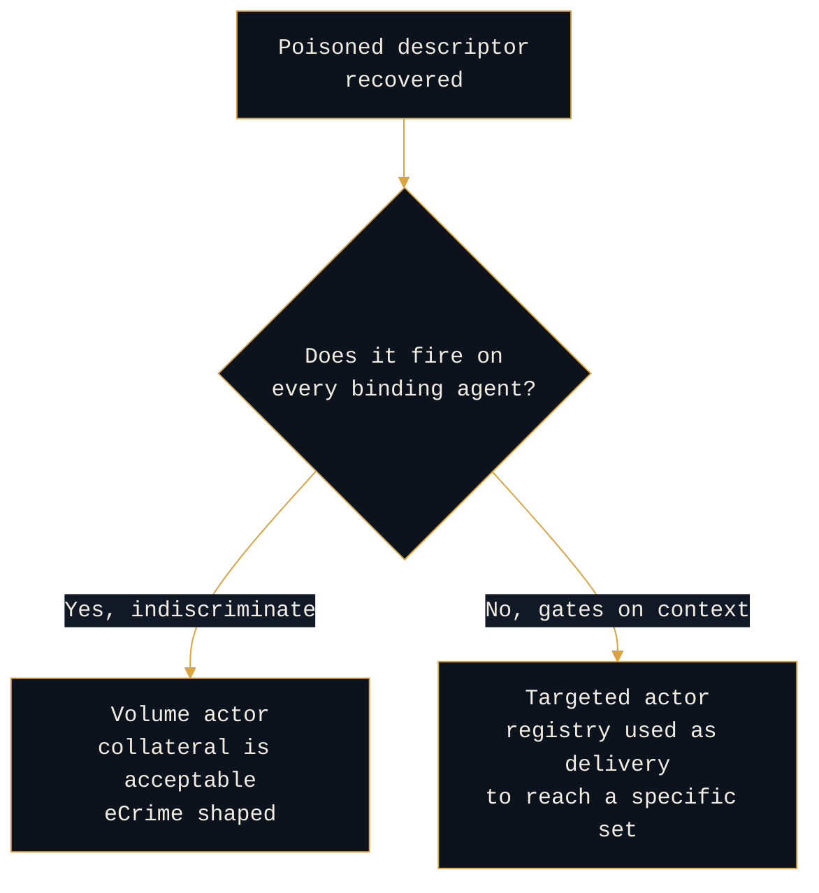

# Reading MCP Descriptor Poisoning: The Supply-Chain Actor's Move

```console
rogue-prompt:~$ cat 02-mcp-descriptor-poisoning
```

**`[OPEN]` hypothesis.** Part 2 of the Persistence Typology series. The anchor piece ([`00-persistence-typology.md`](00-persistence-typology.md)) lays out the lens. Part 1 ([`01-memory-poisoning.md`](01-memory-poisoning.md)) read the opportunist's foothold. This piece reads the move that stops being about one victim.

---

## The move nobody logs as a choice

A poisoned tool descriptor gets written up as a supply-chain incident, which it is, and then filed. What gets lost is that the actor had four ways to persist in an agentic environment and chose the one that reaches everyone downstream.

Memory poisoning buys you one agent. Descriptor poisoning buys you every agent that binds the tool. **An actor does not accidentally choose the second one.** That choice is a statement about how they think, what they are willing to wait for, and how many victims they are comfortable having.

---

## What the mechanism actually is

The actor publishes or modifies a tool descriptor, its name, description, or schema, so that a tool which looks safe behaves maliciously, or so the descriptor itself steers the agent's tool selection. Maps to MITRE ATLAS **AI Agent Tool Poisoning (`AML.T0110`)**, added in the October 2025 MITRE and Zenity Labs collaboration, triggered through **AI Agent Tool Invocation (`AML.T0053`)**.

The load-bearing insight is one most people miss on first pass: **a tool descriptor is untrusted text that gets read as trusted instruction.** The descriptor flows into the model's context so the agent can decide whether and how to call the tool. That makes the description field an injection surface that never touches the user's input at all.

The registry is the watering hole. Poison the entry, and every agent that binds it drinks.

---

## The actor read

Choosing descriptor poisoning tells you four things, and unlike memory poisoning they all point upward.

| The tell | What it bounds |
|---|---|
| **Supply-chain mental model** | Thinks in dependencies, not targets |
| **Population intent** | Objective is reach, not a specific victim |
| **Tolerance for delayed payoff** | Patient; accepts a gap between plant and fire |
| **Ecosystem position** | Had publish rights, or compromised someone who did |

<details>
<summary><b>It reveals a supply-chain mental model</b></summary>

<br>

```console
rogue-prompt:~$ cat tell-1
```

Memory poisoning is a user's model of the system: the app remembers things. Descriptor poisoning is an engineer's model: agents resolve tools from a registry, descriptors flow into context, and context steers selection.

The actor is not attacking the agent. They are attacking the thing the agent trusts to tell it what its tools do. That is dependency thinking, and it is the same instinct behind poisoning a package index or a build pipeline.

</details>

<details>
<summary><b>It reveals population intent</b></summary>

<br>

```console
rogue-prompt:~$ cat tell-2
```

A poisoned descriptor in a shared registry reaches every agent that binds it. The actor is not optimizing for one victim's behavior. They are optimizing for how many agents resolve that tool.

This is organized-eCrime or nation-state supply-chain tradecraft, not opportunism. The actor who poisons a registry has already stopped thinking about any one target.

</details>

<details>
<summary><b>It reveals tolerance for a delayed payoff</b></summary>

<br>

```console
rogue-prompt:~$ cat tell-3
```

The plant does not pay off until an agent binds the tool and a task routes through it. That gap can be days or months, and the actor cannot control it.

An actor who accepts that gap is not looking for a quick win. Compare memory poisoning, where the payoff arrives the next time the victim opens the agent. Willingness to wait is a resourcing signal: it implies the actor has other operations running and is not dependent on this one landing fast.

</details>

<details>
<summary><b>It reveals ecosystem position</b></summary>

<br>

```console
rogue-prompt:~$ cat tell-4
```

To modify a descriptor the actor needed publish rights, or needed to compromise someone who had them, or needed to get a malicious tool accepted into a registry in the first place.

Each of those is a different actor story with different prior access, and separating them matters. A newly published malicious tool is a low bar. A modified descriptor on an established, widely bound tool means a compromised maintainer or publisher, which is a substantially higher bar and a much more serious finding.

</details>

Put together: descriptor poisoning is the supply-chain actor's move. Patient, indirect, aimed at a population rather than a person, and dependent on a position in the ecosystem that had to be earned or taken.

---

## The counter-adversary read: does the payload discriminate?

```console
rogue-prompt:~$ cat targeting
```

This is where the mechanism says something the vulnerability write-ups do not, and it is the reason this deserves its own piece.

A poisoned descriptor reaches everyone who binds the tool. That is a problem for the actor as much as for the defender, because most actors do not actually want every victim. Some do not care. Some care a great deal. **What the payload does when it fires separates them.**



An **indiscriminate** payload tells you the actor treated the registry as a net. Every catch is a win, collateral victims are irrelevant, and the operation is shaped like crimeware.

A **conditional** payload, one that inspects the environment, the tenant, the data in scope, or the calling context before doing anything interesting, tells you something much more specific: the actor used a population-scale delivery mechanism to reach a subset they had already chosen. That is not a net. That is a guided munition with a wide launch envelope, and it is the shape of a targeted operation willing to accept broad exposure to reach a narrow objective.

**The targeting logic in the payload is the closest thing this mechanism gives you to a target list.** For an analyst, that condition is worth more than the payload's capability, because capability tells you what they could do and the condition tells you who they came for.

---

<details>
<summary><b>What it leaves behind, and what it does not</b></summary>

<br>

```console
rogue-prompt:~$ cat forensics
```

Read this as forensics for an analyst, not as a detection rule.

Descriptor poisoning is, in principle, the **most reconstructable** of the four mechanisms, which is the opposite of memory poisoning. Registries are publishing systems, and publishing systems tend to keep records: version history, publisher identity, timestamps, and a diffable artifact. If the registry retains those, you can answer when the descriptor changed, what changed in it, and under whose credentials, which is a genuinely strong evidentiary position.

The blind spots are architectural rather than accidental:

**Descriptors resolved dynamically and never pinned** leave no local record of what the agent actually read at bind time. If the upstream entry has since been cleaned up, the defender cannot reconstruct the descriptor that was in context during the incident.

**No integrity binding between descriptor and tool** means you cannot prove which version an agent bound, only which version exists now.

**A compromised legitimate publisher** produces a record that points at the publisher, not the actor. The artifact is preserved and the attribution still stops one hop short.

The architectural implication mirrors part 1. On memory, the argument was for provenance. Here it is for **pinning and integrity**: not primarily to block the poisoning, but to preserve the ability to say afterward what the agent actually read.

</details>

<details>
<summary><b>What the mechanism does not tell you</b></summary>

<br>

```console
rogue-prompt:~$ cat limitations
```

**The publisher may be a victim, not the actor.** A modified descriptor on a legitimate tool most likely means a compromised maintainer. Reading the publisher as the adversary is the obvious error, and the interesting question is how the maintainer was reached, which is a separate intrusion with its own chain.

**Crudeness can be deliberate.** The false-flag problem from part 1 applies in reverse. A capable actor can publish a sloppy, indiscriminate tool specifically to look like commodity crimeware. Sophistication read from the artifact alone is soft.

**The ecosystem is young and uneven.** Registry trust models, review processes, and publishing controls vary enormously right now. A descriptor that would require a compromised maintainer in one ecosystem might require nothing but an account in another, so the same artifact implies different levels of actor capability depending on where it was found. Any sophistication claim has to name which ecosystem it is reasoning about.

**The case record is thin.** Most of the public corpus is research and red-team demonstration rather than attributed in-the-wild intrusion. This piece reasons from tradecraft analogy, which is why it carries `[OPEN]`.

</details>

---

## Where this sits in the typology

Descriptor poisoning sits above memory poisoning on both axes that matter. Higher sophistication, because it requires a model of how agents resolve and trust tools. Wider reach, because it is one-to-many by construction.

It is not the top of the typology. Index and embedding poisoning is slower, harder to attribute, and aimed at shaping conclusions across a population over time, where descriptor poisoning is aimed at access. The distinction is worth holding: **descriptor poisoning wants what the agent can do, index poisoning wants what the agent believes.**

**Next in the series:** [`03-token-oauth-persistence.md`](03-token-oauth-persistence.md), where the actor stops touching the agent at all and holds the credential instead.

---

<details>
<summary><b>Attribution</b></summary>

<br>

```console
rogue-prompt:~$ cat prior-art
```

| Concept | Source |
|---|---|
| AI Agent Tool Poisoning | MITRE ATLAS `AML.T0110`, added October 2025, MITRE and Zenity Labs |
| AI Agent Tool Invocation | MITRE ATLAS `AML.T0053` |

The persistence-as-actor-signal lens is an application of traditional intrusion-analysis tradecraft to the agentic AI surface. The tradecraft is not mine. The mapping to this surface is the contribution, and it is a hypothesis, not a finding.

</details>

> _All opinions are my own and do not reflect my employer._
