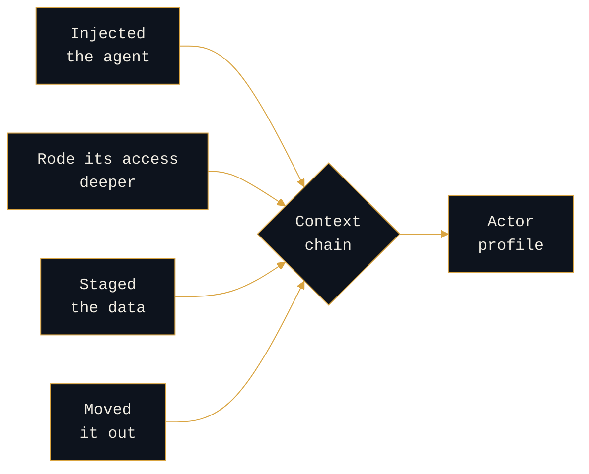

<div align="center">

# Reading the AI Adversary

**Counter-adversary research and defense-in-depth for AI systems.**

How an AI system is attacked is a fingerprint for *who* attacked it.


</div>

---

## The thesis

```console
rogue-prompt:~$ cat thesis
```

> **Attribution comes from context, not indicators. How an adversary abused the AI is new context.**

An IOC is cheap and disposable. What identifies an actor is the whole chain: they injected the agent, rode its access deeper into the environment, staged the data, moved it out. Every step is a context clue, and together they build the profile. The AI compromise is one thread in that chain. Read it in isolation, as an application-security bug, and you throw the picture away. Read it as part of the campaign, and it becomes attribution.

This is the Pyramid of Pain applied to AI: atomic indicators at the bottom, behavior and context at the top, and the way an adversary uses AI is a new source of high-value behavior. Attribution was always convergence. AI tradecraft is a new axis of it.



No single step names the adversary. The chain does.

**The defensive companion.** Every control on an AI system is either **structural** (it decides from a fact the adversary cannot rewrite: signed tokens, egress allowlists, bind manifests) or **statistical** (a classifier it can evade, and one that fails silently when it does). Statistical controls buy cost and signal. Structural controls are what hold. Reading the attack in context tells you two things at once: which controls the adversary beat, and which choices they made, which point back to who they are.

---

## Navigate

```console
rogue-prompt:~$ ls -R
```

The adversary section leads. The defense section exists to show what the offense implies, not the other way around. **Start with `01`.**

| Path | What it is | Status |
|---|---|---|
| [`01 · persistence-typology/`](01-reading-the-ai-adversary/persistence-typology) | Persistence mechanism read as an actor-intent signal (a series) | anchor and memory poisoning **live** |
| [`01 · kill-chains/`](01-reading-the-ai-adversary/kill-chains) | One chain per OWASP LLM ID, two lenses each | method and LLM01 **live** |
| [`01 · actor-profiling.md`](01-reading-the-ai-adversary/actor-profiling.md) | Threat-actor-to-AI-tooling profiling, public actors | drafting |
| [`02 · structural-vs-statistical.md`](02-defense-in-depth/structural-vs-statistical.md) | The defensive thesis | **live** |
| [`02 · defense-in-depth/`](02-defense-in-depth) | Structural core, trusted computing base, detection, frameworks | drafting |
| [`open-questions.md`](open-questions.md) | What is unsolved, and where I know it breaks | **live** |

---

## How to read the labels

```console
rogue-prompt:~$ cat conventions
```

Everything here is labeled, honestly.

| Label | Means |
|---|---|
| **`[ANALYSIS]`** | Adversary-behavior analysis grounded in public frameworks. |
| **`[DESIGN]`** | Worked-through architecture. Mine, defensible, not a deployed system. |
| **`[OPEN]`** | A hypothesis staked in public ahead of the case files, open to being wrong. |

This is a reference architecture, not a product. It operationalizes existing frameworks; it does not propose a new one. Nothing here is a deployed system, a weaponized artifact, or drawn from any employer environment. **Public cases and general method only.** If a section reads to you like an operational claim, that is a bug. Tell me.

---

<details>
<summary><b>Prior art, named</b></summary>

<br>

| Concept | Source |
|---|---|
| The lethal trifecta | Simon Willison, 2025 |
| Least agency | OWASP Top 10 for Agentic Applications, 2026 |
| Instruction and data separation | Dual-LLM pattern (Willison, 2023); CaMeL (Google DeepMind, 2025) |
| PDP/PEP, deny-by-default | NIST SP 800-207 |
| Cyber Kill Chain, courses-of-action matrix | Lockheed Martin |
| Intrusion analysis models | Diamond Model; Pyramid of Pain |
| Technique vocabularies | MITRE ATLAS, MITRE D3FEND |
| Risk taxonomies | OWASP LLM Top 10 2025, Agentic Top 10 2026 |
| Governance | NIST AI RMF, Generative AI Profile (AI 600-1) |

</details>

---

## Whoami

```console
rogue-prompt:~$ whoami
```

Cyber threat intelligence and counter-adversary operations. I led a team that detected, disrupted, and neutralized adversaries in real time inside a large regulated enterprise. Today I work in AI security, and this repo is where I bring that discipline to AI counter-adversary operations.

Everyone else is arriving at AI security from application security. I am arriving from the adversary.

**More:** [rogue-prompt.com](https://rogue-prompt.com) · [Substack](https://rogueprompt.substack.com) · [LinkedIn](https://www.linkedin.com/in/jayd-rogueprompt)

> _All opinions are my own and do not reflect my employer._
