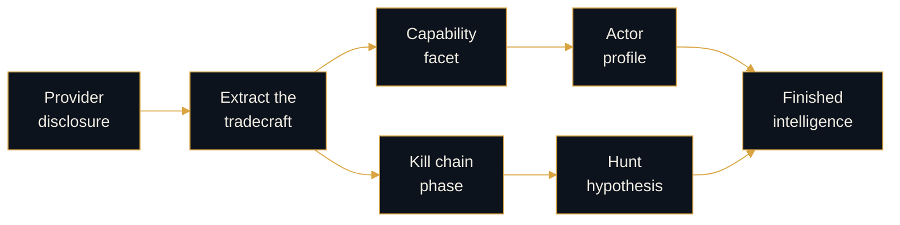

<div align="center">

# Reading the AI Adversary

**Counter-adversary research on how threat actors use AI.**

How an adversary uses AI is a fingerprint for *what they can afford.*


</div>

---

## The thesis

```console
rogue-prompt:~$ cat thesis
```

> **Attribution reads constraint. An adversary's AI tooling choices are constraint made visible.**

Attribution was never about indicators. It is about what an actor could not afford. Budget shows up in tooling. Deadlines show up in tempo. Fear of consequence shows up in operational security. The adversary leaks their conditions through every choice they make, and the conditions are the fingerprint.

AI use is a new surface for that same read. Which model an actor reaches for, what they delegate to it, whether they buy tooling or build it, how patiently they work around a refusal: each is a decision made under conditions, and each is recoverable from the public record.

This repo treats provider misuse reporting as a collection source and runs the intelligence cycle against it.


```mermaid
%%{init: {'theme':'base','themeVariables':{'primaryColor':'#0d131d','primaryTextColor':'#f0ece2','primaryBorderColor':'#d9a441','lineColor':'#d9a441','secondaryColor':'#111926','tertiaryColor':'#070b13','fontFamily':'monospace'}}}%%
flowchart LR
    A["Provider<br/>disclosure"] --> B["Extract the<br/>tradecraft"]
    B --> C["Capability<br/>facet"]
    B --> D["Kill chain<br/>phase"]
    C --> E["Actor<br/>profile"]
    D --> F["Hunt<br/>hypothesis"]
    E --> G["Finished<br/>intelligence"]
    F --> G
```

Most enterprises read those disclosures as industry news. They are finished intelligence about adversary AI tradecraft, published by the only parties with direct visibility into it, and almost nobody is collecting them as such.

---

## Navigate

```console
rogue-prompt:~$ ls -R
```

Method leads. Case files are the output. Everything in `90` is supporting material.

| Path | What it is | Status |
|---|---|---|
| [`01 · method/`](01-method) | The extraction method, and the analytic questions it turns on | drafting |
| [`02 · case-files/`](02-case-files) | The method run against public cases, one file each | drafting |
| [`03 · ai-and-identity/`](03-ai-and-identity) | Agent identity, non-human credentials, and what they are worth to an adversary | planned |
| [`04 · criminal-ai-ecosystems/`](04-criminal-ai-ecosystems) | Adversary AI tooling as a market, read from public reporting | planned |
| [`90 · defending-ai-deployments/`](90-defending-ai-deployments) | Persistence typology, structural and statistical controls, defense in depth | several **live** |
| [`open-questions.md`](open-questions.md) | What is unsolved, and where I know it breaks | **live** |

---

## The central analytic question

```console
rogue-prompt:~$ cat force-multiplier-or-new-capability
```

Every case file turns on one question: **did the model make an existing capability cheaper, or did it create a capability the actor did not previously have?**

A force multiplier changes volume, speed, and cost. That changes detection thresholds and triage load, and it does not change the threat model. A genuinely new capability changes the threat model itself.

**`[OPEN]`** My reading of the public record is that the overwhelming majority of attributed misuse falls on the force-multiplier side. The defensive implication is unglamorous: most of what provider reporting describes should raise your expected volume rather than send you rebuilding controls.

This is staked ahead of the evidence, and it is the kind of claim that should age. A case that clearly demonstrates a capability an actor could not otherwise field would move it. The case files are where that gets tested rather than asserted.

---

## How to read the labels

```console
rogue-prompt:~$ cat conventions
```

Everything here is labeled, honestly.

| Label | Means |
|---|---|
| **`[ANALYSIS]`** | Adversary-behavior analysis grounded in public frameworks and public reporting. |
| **`[DESIGN]`** | Worked-through architecture. Mine, defensible, not a deployed system. |
| **`[OPEN]`** | A hypothesis staked in public ahead of the case files, open to being wrong. |

---

## Sourcing

```console
rogue-prompt:~$ cat sourcing
```

**Public reporting only.** Provider threat reports, GTIG and Mandiant, CISA advisories, vendor research, and equivalent published work. Report titles, dates, and actor designations are verified against the primary source before publication.

Nothing here is drawn from any employer environment. Nothing here derives from non-public collection. Nothing here is a detection, a rule, or an operational artifact. If a section reads to you like an operational claim, that is a bug. Tell me.

---

<details>
<summary><b>Prior art, named</b></summary>

<br>

| Concept | Source |
|---|---|
| The lethal trifecta | Simon Willison, 2025 |
| Least agency | OWASP Top 10 for Agentic Applications, 2026 |
| Instruction and data separation | Dual-LLM pattern (Willison, 2023); CaMeL (Google DeepMind, 2025) |
| PDP/PEP, deny-by-default | NIST SP 800-207 |
| Cyber Kill Chain, courses-of-action matrix | Lockheed Martin |
| Intrusion analysis models | Diamond Model; Pyramid of Pain |
| Technique vocabularies | MITRE ATLAS, MITRE D3FEND |
| Risk taxonomies | OWASP LLM Top 10 2025, Agentic Top 10 2026 |
| Governance | NIST AI RMF, Generative AI Profile (AI 600-1) |

</details>

---

## Whoami

```console
rogue-prompt:~$ whoami
```

I came to AI security from the adversary. Years running and leading counter-adversary operations against nation-state APTs, ransomware crews, and organized criminal groups, working the intelligence cycle end to end: requirements, collection, analysis, and the briefing at the other end of it. Navy first, then CTI, with a contribution to the Verizon DBIR and support on two CISA #StopRansomware advisories along the way.

Today I work in AI security. This repo is where that discipline gets pointed at adversary use of AI.


 
**More:** [rogue-prompt.com](https://rogue-prompt.com) · [Substack](https://rogueprompt.substack.com) · [LinkedIn](https://www.linkedin.com/in/jayd-rogueprompt)

> _All opinions are my own and do not reflect my employer._
