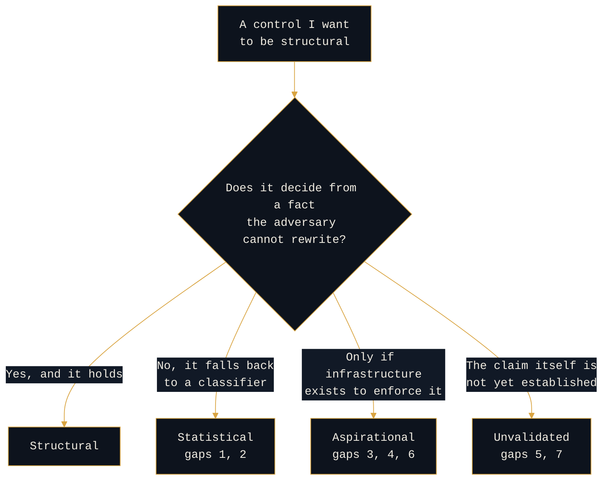

# Open Questions

```console
rogue-prompt:~$ cat open-questions
```

This page exists on purpose, and it is the right place to start. In agentic AI security the open problems are as diagnostic as the solved ones: an architecture that cannot name its own unsolved gaps has not been stress-tested against them. Naming them is not a caveat to the work. It is part of the work.

These are the places where the architecture in this repo does not close the gap. None of them is quietly closed somewhere else.

**Everything on this page is `[OPEN]`.** Each item is a hypothesis or a named gap, staked in public ahead of the case files, and open to being wrong.

| # | Gap | Why it does not close |
|---|---|---|
| 1 | Pure-text domain harm | No tool call to gate, so no structural control stands behind the classifier |
| 2 | Output-encoded exfiltration to an allowlisted destination | The destination is benign; the payload is the problem |
| 3 | Scheduled-task risk discount | The `scheduled` flag is trusted, not verified |
| 4 | Tuning-loop integrity | The control plane modifies itself from human behavior |
| 5 | Weight-level backdoor detection | Out of reach for a model consumer, and out of scope |
| 6 | Mission Manifest enforcement | Structural only if a real enforcement surface exists |
| 7 | The persistence typology itself | Reasoned by analogy, not yet validated against attributed intrusions |

### Why they fail

They do not fail randomly. Each one is a control that should be structural, breaking in one of three ways.



**Statistical** means the adversary can evade it, and it fails silently when they do. **Aspirational** means the control is real on paper and absent in the deployment. **Unvalidated** means the honest answer is that the research is not there yet.

---

<details>
<summary><b>1. Pure-text domain harm has no structural backstop</b></summary>

<br>

The domain classifier (is this bio, cyber, finance) is statistical. When the harm lives entirely in generated text, with no tool call, no external send, and no privileged action, there is no structural control standing behind it. The lethal-trifecta vetoes and the egress allowlist do nothing here, because nothing is being sent or executed: the text itself is the harm.

In an enterprise deployment this is either an accepted residual risk or it is handled out of band by content policy. I do not claim to close it structurally, because on a probabilistic text generator you cannot.

</details>

<details>
<summary><b>2. Output-encoded exfiltration to an allowlisted destination</b></summary>

<br>

The hardest exfiltration channel. An agent encodes sensitive data into legitimate-looking output and sends it to a destination on the egress allowlist. The destination is benign; the payload is the problem. Maps to ATLAS `AML.T0086`.

The egress allowlist, which breaks most exfiltration, does not break this. The forensic artifact is weak: an output hash proves something left without revealing what it meant. This is a named blind spot in forensic reconstructability, not a solved problem.

</details>

<details>
<summary><b>3. The scheduled-task risk discount is a potential side channel</b></summary>

<br>

A registered, pre-approved recurring task receives a lower risk treatment. Two unresolved questions make it unsafe to ship.

First, who sets the `scheduled` flag, and how is that verified structurally rather than taken on trust. Second, how does approving a parameter range avoid handing an attacker the discount while they operate maliciously inside the approved range.

Until both are answered, the discount is an on-ramp, not a control.

</details>

<details>
<summary><b>4. Tuning-loop integrity</b></summary>

<br>

The risk thresholds are meant to be tuned over time from human override patterns. That makes the tuning path a control plane that modifies itself from human behavior, which makes it an attack surface. A patient adversary, or an insider generating consistent overrides, can drift the thresholds.

I have not designed the integrity controls for that modification path. This is an insider-threat problem before it is an AI problem, and it is not written up yet.

</details>

<details>
<summary><b>5. Weight-level backdoor detection is out of reach and out of scope</b></summary>

<br>

For an enterprise that consumes models rather than training them, detecting a trigger-activated backdoor in model weights through behavioral probing is beyond current capability.

The honest control is provenance and version pinning, not detection. I do not claim backdoor detection here, and I treat detection claims elsewhere as ahead of the research until proven otherwise.

</details>

<details>
<summary><b>6. Mission Manifest enforcement depends on infrastructure that may not exist</b></summary>

<br>

The signed Mission Manifest is only structural if there is a real enforcement surface, separate from the model, that verifies the signature at every step. In a deployment without that infrastructure the manifest is aspirational, and the control is effectively statistical.

Whether a given enterprise actually has that surface is the difference between this architecture being structural and being a diagram.

</details>

<details>
<summary><b>7. The persistence typology is a hypothesis, not a finding</b></summary>

<br>

See [`01-reading-the-ai-adversary/persistence-typology/`](01-reading-the-ai-adversary/persistence-typology).

The mechanism-to-sophistication mapping is reasoned by analogy from traditional tradecraft, not yet validated against a body of attributed agentic intrusions. It is useful for triage today. It is not established, and a sophisticated actor can deliberately spoof the mechanisms.

</details>

---

## The meta-point

Several of these break the same way: a control I would like to be structural turns out to depend on a classifier, or on infrastructure the enterprise may not have.

That is the recurring failure mode of agentic AI security, and it is the whole reason this repo is organized around the structural-versus-statistical partition. The partition does not solve these problems. It makes them visible, which is the first honest step.

> _All opinions are my own and do not reflect my employer._
